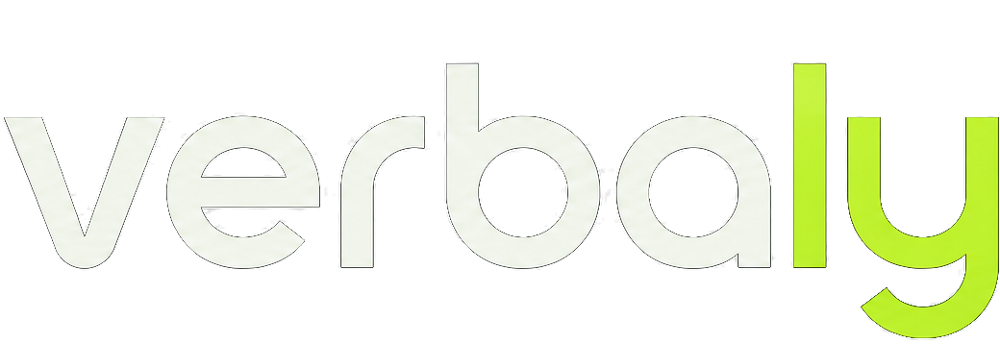

<p align="center">
  <picture>
    
  </picture>
</p>

<p align="center">
  <em>Effortless i18n: write natural text, ship type-safe, tree-shakeable translations.</em>
  <br />
  <strong>TypeScript</strong> · <strong>Vite</strong> · <strong>Compiler + runtime</strong> · <strong>Zero-config</strong>
</p>

<p align="center">
  <a href="https://www.npmjs.com/package/verbaly"></a>
  <a href="https://github.com/AronSoto/verbaly/actions/workflows/ci.yml"></a>
  <a href="https://codecov.io/gh/AronSoto/verbaly"></a>
  <a href="https://socket.dev/npm/package/verbaly"></a>
  
  
  <a href="./LICENSE"></a>
</p>

---

## What is Verbaly?

Most i18n tools make you **maintain key files by hand**: keys drift from the code, there's no type-safety, and setup is heavy.

**Verbaly inverts the flow.** You write the source text right in your code. A build plugin extracts the messages, generates **stable keys, types, and one module per locale**. So you get compiler-grade safety with a runtime under **~3KB**.

```ts
// You write this:
t`Hello ${name}, you have ${count} messages`;

// The compiler generates: a stable key + inferred types + per-locale entries.
t('EMo3ph4u', { name, count }); //  ← fully typed, tree-shakeable
```

Missing a translation? **The build fails**, so raw keys never reach production.

---

## Quick start

```bash
pnpm add verbaly @verbaly/vite
```

```ts
// vite.config.ts
import verbaly from '@verbaly/vite';

export default {
  plugins: [verbaly({ locales: ['en', 'es', 'pt'] })],
};
```

```ts
// anywhere in your app
import { t, setLocale } from 'virtual:verbaly';

t`Hello ${name}`; // extracted + typed on save
await setLocale('es'); // per-locale bundle loaded on demand
```

The same works inside `.svelte` and `.vue` components, script and markup:

```svelte
<h1>{$t`Hello ${name}`}</h1>
```

Plain HTML, no framework? Bind by attribute:

```html
<h1 data-verbaly="home.title"></h1>
```

👉 Full docs & live playground: **https://verbaly-web.vercel.app**

---

## Packages

| Package                                    | Version                                                                                                            | Description                                                                           |
| ------------------------------------------ | ------------------------------------------------------------------------------------------------------------------ | ------------------------------------------------------------------------------------- |
| [`verbaly`](packages/core)                 | [](https://www.npmjs.com/package/verbaly)                       | Core runtime: `t`, locale store, `Intl` formatting, DOM interpreter                   |
| [`@verbaly/compiler`](packages/compiler)   | [](https://www.npmjs.com/package/@verbaly/compiler)   | Message extraction, type-safe codegen and CLI                                         |
| [`@verbaly/vite`](packages/vite)           | [](https://www.npmjs.com/package/@verbaly/vite)           | Zero-config Vite plugin with live extraction                                          |
| [`@verbaly/unplugin`](packages/unplugin)   | [](https://www.npmjs.com/package/@verbaly/unplugin)   | webpack, Rollup, esbuild & Rspack via unplugin                                        |
| [`@verbaly/react`](packages/react)         | [](https://www.npmjs.com/package/@verbaly/react)         | React hooks (`useT`, `useLocale`) + `<Trans>`                                         |
| [`@verbaly/vue`](packages/vue)             | [](https://www.npmjs.com/package/@verbaly/vue)             | Vue 3 composables (`useT`, `useLocale`) + `<Trans>`                                   |
| [`@verbaly/svelte`](packages/svelte)       | [](https://www.npmjs.com/package/@verbaly/svelte)       | Svelte 5 stores (`useT`, `useLocale`) + `<Trans>`                                     |
| [`@verbaly/sveltekit`](packages/sveltekit) | [](https://www.npmjs.com/package/@verbaly/sveltekit) | SvelteKit SSR: per-request locale, flash-free hydration                               |
| [`@verbaly/nuxt`](packages/nuxt)           | [](https://www.npmjs.com/package/@verbaly/nuxt)           | Nuxt SSR: zero-config module, per-request locale, flash-free hydration                |
| [`@verbaly/next`](packages/next)           | [](https://www.npmjs.com/package/@verbaly/next)           | Next.js App Router/RSC: Turbopack & webpack, per-request locale, flash-free hydration |
| [`@verbaly/astro`](packages/astro)         | [](https://www.npmjs.com/package/@verbaly/astro)         | Astro integration: write-in-source `.astro` extraction, automatic per-locale SSG      |
| [`@verbaly/mcp`](packages/mcp)             | [](https://www.npmjs.com/package/@verbaly/mcp)             | MCP server: status, missing keys, extraction and machine translation for agents       |

---

## Why it's different

- **Hybrid compiler + runtime**: static text is compiled (types + tree-shaking); dynamic/CMS content has a real runtime path. No forced trade-off.
- **Type-safe params**: `{name}`, plurals, currency and dates are inferred from the message itself. Wrong or missing params fail to compile.
- **`Intl` all the way**: number, currency, date/time, relative time (`{when:relative}`), lists (`{langs:list}`) and units (`{d:unit/kilometer}`). Zero dependencies, the platform does the heavy lifting.
- **Tiny & tree-shakeable**: ~3KB gzip core, zero dependencies, per-locale code-splitting.
- **Fast, with receipts**: fully memoized hot path: 5-35× faster than i18next on lookup/interpolation/plurals (`pnpm bench`, benchmarked every release).
- **No proprietary format**: plain, portable JSON catalogs. No lock-in. Most TMS platforms ingest them natively, and `verbaly export`/`import` round-trips XLIFF 2.0, CSV or gettext PO with human translators; exports carry the source-file location of every message so translators see context, and imports are structure-validated, so a typo in a `{param}` or tag never reaches your UI. The same catalogs also export as native mobile resources (`--format android-xml` / `ios-strings`) for a companion app.
- **Works with plain HTML**: a `data-verbaly` DOM interpreter for the framework-less case, with opt-in rich text (`data-verbaly-rich`, whitelist-based, XSS-safe), named links (`richLinks`; hrefs from your code, never from messages) and locale bootstrap helpers (`resolveLocale`/`persistLocale`).
- **Fails the build on missing translations**: the #1 i18n pain, gone. And on **broken** ones: `verbaly check` reads every translation against its source and rejects the ones that cannot render it, whether they came from a translator, a machine or a hand edit. A dropped `{param}`, a lost `<em>`, a flattened plural block, a plural set with no catch-all case (that one renders an empty string) all stop the build with the reason in plain words, annotated on the source line in CI. It also warns, without failing, when a language needs plural forms your catalog does not carry yet. And when a catalog reaches your app without passing through the build (a lazy loader, a CMS), the runtime reports the same problems in the console instead of degrading quietly: it never crashes on bad data, and it never hides it either.
- **RTL and language names built in**: adding Arabic or Hebrew just works: `switchLocale`, the SSR integrations and `verbaly render` keep `<html dir>` right on their own, and `localeName('es')` gives your locale switcher real names ('español') via `Intl.DisplayNames`, no hardcoded tables.
- **Static sites ship translated**: `verbaly render` pre-fills your built HTML per locale (`dist/es/…`, `<html lang>` and `<html dir>` set). No flash of untranslated content on SSG.
- **i18n QA built in**: `verbaly pseudo` generates a pseudo-locale (`⟦Ĥéĺĺó ~⟧`) that exposes hardcoded strings and clipped layouts; `verbaly translate` fills real locales via Claude or your own provider; `verbaly doctor` diagnoses the whole setup with the exact fix for each finding.

### How it compares

|                           | **Verbaly**           | i18next            | Lingui                 | Paraglide      | typesafe-i18n |
| ------------------------- | --------------------- | ------------------ | ---------------------- | -------------- | ------------- |
| Type-safe keys & params   | ✅ inferred from text | plugin/manual      | partial                | ✅             | ✅            |
| Runtime size (gzip)       | **~3KB, zero deps**   | ~14KB (+9KB react) | ~5KB                   | ~0 (compiled)  | ~1KB          |
| Setup                     | 1 Vite plugin         | heavy config       | macros + Babel/SWC     | inlang project | generator     |
| Key maintenance           | **none, extracted**   | by hand            | extract → compile step | by hand        | by hand       |
| Dynamic / CMS content     | ✅ real runtime path  | ✅                 | ✅                     | ⚠️ weak        | ✅            |
| Plain HTML (no framework) | ✅ DOM interpreter    | ❌                 | ❌                     | ❌             | ❌            |
| Missing-translation gate  | ✅ build fails        | runtime warning    | CI step                | ✅             | ❌            |
| Broken-translation gate   | ✅ build fails        | ❌                 | ❌                     | ❌             | ❌            |
| Catalog format            | plain JSON            | JSON               | PO/JSON                | inlang format  | TS files      |

---

## Coding agents

Verbaly ships first-class support for AI coding agents:

- **MCP server**: give your agent the whole cycle as tools (`verbaly_status`, `verbaly_missing`, `verbaly_extract`, `verbaly_translate`):

  ```bash
  claude mcp add verbaly -- npx -y @verbaly/mcp
  ```

  Machine translations stay drafts until a human approves them (`verbaly review --approve`), so an agent can fill gaps without silently shipping unreviewed text.

- **Agent Skill**: [`skills/verbaly`](skills/verbaly/SKILL.md) teaches an agent the write → extract → check → translate cycle and the rules that keep it safe. Install it into a project:

  ```bash
  npx degit AronSoto/verbaly/skills/verbaly .claude/skills/verbaly
  ```

- **llms.txt**: the docs site publishes [verbaly-web.vercel.app/llms.txt](https://verbaly-web.vercel.app/llms.txt) for agents that read documentation.

---

## Editor: translations on hover

Verbaly keys are hashes, so reading `t('a1B2c3D4')` in a diff tells you nothing. The [i18n-ally](https://marketplace.visualstudio.com/items?itemName=Lokalise.i18n-ally) extension can show the real text inline and on hover once you point it at your catalogs. Two files, and no Verbaly config changes:

`.vscode/settings.json`

```json
{
  "i18n-ally.localesPaths": ["locales"],
  "i18n-ally.keystyle": "flat",
  "i18n-ally.sourceLanguage": "en",
  "i18n-ally.displayLanguage": "en"
}
```

`.vscode/i18n-ally-custom-framework.yml`

```yaml
languageIds:
  - javascript
  - typescript
  - javascriptreact
  - typescriptreact
  - vue
  - svelte
  - astro
usageMatchRegex:
  - "[^\\w\\d]t\\(\\s*['\"`]({key})['\"`]"
monopoly: true
```

`keystyle: flat` matters: Verbaly catalogs are flat maps, so the default nested guess would read a dotted key as a path. Use the extension for reading, not for writing: its extract and rename actions assume you own the keys, and in Verbaly the compiler does. New keys come from `verbaly extract`, translations from your catalogs, `verbaly export`/`import` or `verbaly translate`.

---

## Development

```bash
pnpm install
pnpm build      # tsdown → ESM + CJS + .d.ts
pnpm test       # Vitest
pnpm coverage   # full suite + lcov report
pnpm typecheck
pnpm --filter verbaly bench   # hot-path benchmarks vs i18next
```

> ⚠️ Early development. `0.x` published: API not stable yet.

---

## Feedback

Using Verbaly? That already helps. What helps even more:

- **Something broke or surprised you** → [open a bug](https://github.com/AronSoto/verbaly/issues/new?template=bug_report.yml). A minimal snippet is enough.
- **Something felt like friction** → [tell us what](https://github.com/AronSoto/verbaly/issues/new?template=feature_request.yml). The roadmap is driven by real use, not by feature lists.
- **It just works** → a [star](https://github.com/AronSoto/verbaly) or a mention helps others find it.

Contributions welcome: see [CONTRIBUTING.md](CONTRIBUTING.md).

---

## Sponsor Verbaly

<p align="center">
  <a href="https://github.com/sponsors/AronSoto"></a>
</p>

<p align="center">
  Verbaly is <strong>MIT-licensed</strong>, dependency-free and built independently.<br />
  If it saves you time shipping i18n, consider sponsoring the project. It funds the road to <strong>1.0</strong>:<br />
  more framework integrations, faster releases and long-term maintenance.
</p>

<p align="center">
  <a href="https://github.com/sponsors/AronSoto">
    
  </a>
</p>

## License

[MIT](./LICENSE) © Aron Soto · [@AronSoto](https://github.com/AronSoto)
